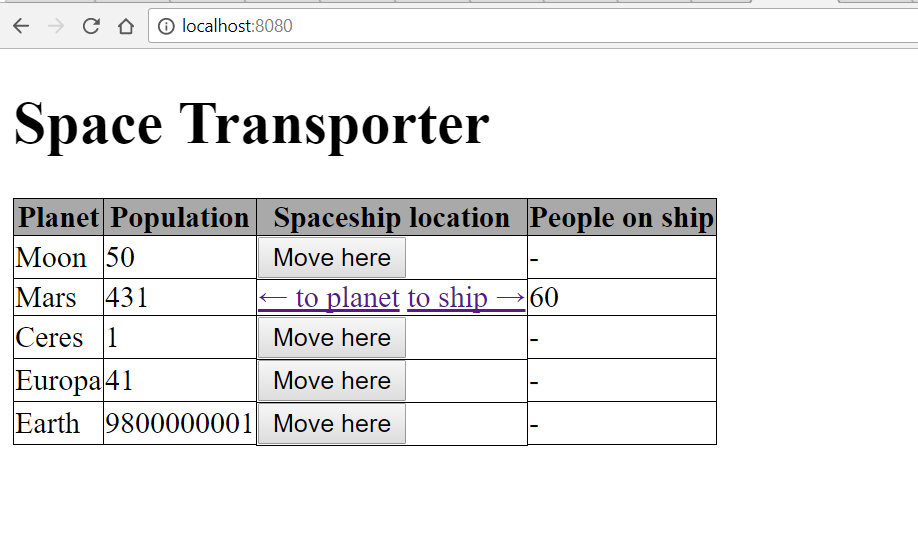
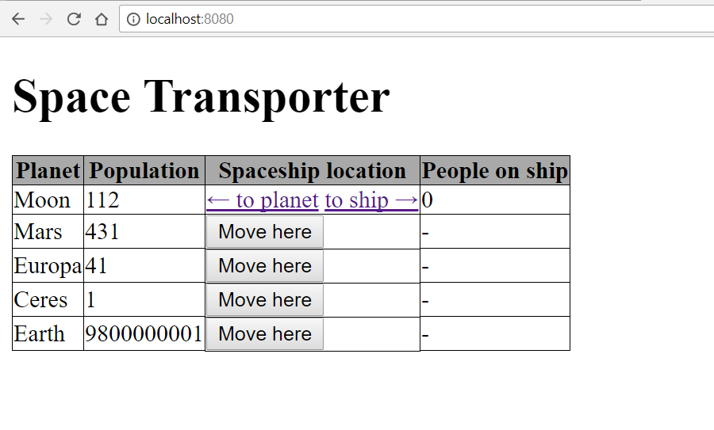

# Corsac Orientation 

## 1) Space Transporter

Let's imagine that it's 2050 and we are able to travel through space.
Build a cool application that will be able to transport people anywhere in the endless space.

# Main page



- the **frontend** should have
    - a heading with the title of the site
    - table as depicted above
    - buttons to move the spaceship to any planet
    - arrows to move the people
    - consider using some special html characters for the arrows

## Backend
- there should be only one spacehsip and more planets
- when **Move here** button is submitted the backend should
    - set the spacehsip so that it will move to the planet of the same row where it was clicked
    - spaceship can be only at one planet at a time
    - save the changes to the database
- when **to planet** is clicked the backend should
    - increase the population of the planet and in contrast decrease the utilization of the spacehsip with the same amount
    - save the changes to the database
- when **to ship** is clicked the backend should
    - increase the utilization of the spaceship and in contrast decrease the population of the planet with the same amount
    - save the changes to the database
- the max capacity of the spaceship is 60 currently
    - it can *NOT* transport more people then this number
    - and it can *NOT* hold more people in the spaceship than the max capacity

## Endpoints
- you should create these endpoints:

### GET `/`
- the endpoint should render an HTML displaying the main page

### POST `/movehere/{id}`
- this endpoint should be responsible for moving the ship around
- you should check if the `name` of the planet equals to the `planet` of the spaceship
- set the new planet of the spaceship
- save changes
- redirect to the main page


### GET `/toship/{id}`
- this endpoint should move the people to the ship
    - the max capacity of people can be moved on one click
    - if there is less people on the planet than the max capacity of the ship, move everybody to the ship
    - if there is less people on the spaceship than the max capacity, then only remove people from the planet that fills up the spacehsip to the full capacity
- save changes
- redirect to the main page

### GET `/toplanet/{id}`
- this endpoint should move the people to the planet
    - only the recent number of passangers can be moved on to the planet, no more, no less
- save changes
- redirect to the main page    



## 2) Question time
  What is the class structure of the JSON below? Please write down the class(es) with fields:

  ```json
  {
      "result": "ok",
      "clothes":
      [
          {
              "id": "21",
              "item_name": "Strecth Steamed Pencil Skirt",
              "manufacturer": "Calvin Klein",
              "category": "skirts",
              "size": "s",
              "unit_price": 39.0,
          },
          {
              "id": "24",
              "item_name": "Strecth Steamed Pencil Skirt",
              "manufacturer": "Calvin Klein",
              "category": "skirts",
              "size": "m",
              "unit_price": 39.0,
          },
      ]
  }
  ```
