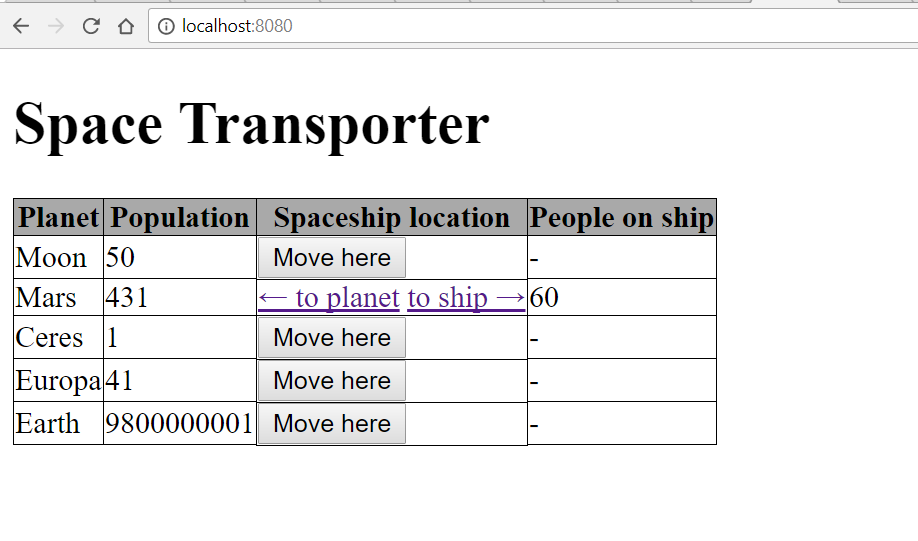
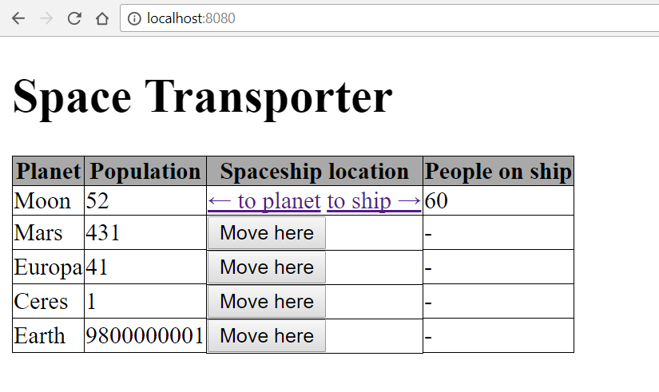
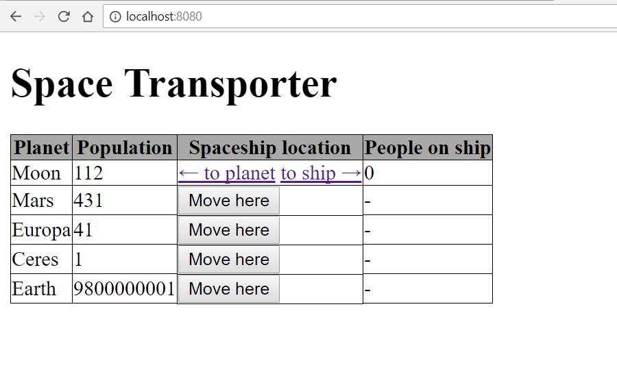

# Corsac Orientation

## 1) Space Transporter

Let's imagine that it's 2050 and we are able to travel through space.

Build a cool application that will be able to transport people anywhere in the endless space.

# Main page



## Frontend
 - a heading with the title of the site
 - create the table as depicted above
    - you should render the table dynamically with JS on page load
 - buttons to move the spaceship to any planet
     - if you click 'move here', the table should re-render 
 - arrows to move the people
    - you can use buttons instead of links
    - consider using unicode characters for the arrows
 - use AJAX/XHR to send requests to the backend

## Backend
- there should be only one spaceship and more planets
- when **Move here** button is clicked the backend should:
    - update the spaceship so it will move to the given planet
    - spaceship can be only at one planet at a time
    - save the changes to the database
- when **to planet** link is clicked the backend should
    - increase the population of the planet and in contrast decrease the utilization of the spaceship with the same amount
    - save the changes to the database
- when **to ship** link is clicked the backend should
    - increase the utilization of the spaceship and in contrast decrease the population of the planet with the same amount
    - save the changes to the database
- *the max capacity of the spaceship* is 60, it's fine to hardcode it somewhere
    - it can *NOT* transport more people then this number
    - and it can *NOT* hold more people in the spaceship than the max capacity

## Endpoints
- you should create these endpoints:

### GET `/`
- the endpoint should return an `index.html` displaying the main page and assets

### GET `/planets`
- it should return the list of planets with the population

```json
[
    {
     "id": 1,
     "name": "Moon",
     "population": 50
    },
    ...
]
```

### POST `/movehere/{planet_id}`
- this endpoint should be responsible for moving the ship around
- you should check if the `name` of the planet equals to the `planet` of the spaceship
- update the the spaceship with the target planet

#### return the following JSON
    {"result": "success"}

OR:

    {"result": "error"}



### POST `/toship/{planet_id}`
- this endpoint should move the people to the ship
    - the max capacity of people can be moved on one click
    - if there is less people on the planet than the max capacity of the ship, move everybody to the ship
    - if there is less people on the spaceship than the max capacity, then only remove people from the planet that fills up the spacehsip to the full capacity

### POST `/toplanet/{planet_id}`
- this endpoint should move all the people to the planet
- reset the spaceship utilization to zero
- increase planet population


